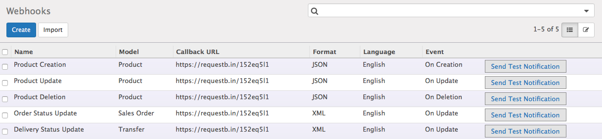

.. _configuration:

Configuration
=============

If you already have an **Odoo server**, **restapi** and **webhook** module installed, you can configure your webhooks, one of two ways:

1. :ref:`Through the API <through-api>`
2. :ref:`Through your user panel <through-user-panel>`

.. _through-api:

Through the API
---------------

Odoo requires users to be authenticated before they can register webhook through API.

.. note:: For more information concerning Odoo authentication, View our `REST API Reference <http://odoo-restapi-docs.synconics.com>`_ guide.

Once the authentication is done through the Odoo **OAuth 1.0** ``restapi/1.0/common/oauth1`` or **OAuth 2.0** ``restapi/1.0/common/oauth2`` endpoints, The Odoo REST API lets you do the following with the Webhook resource:

* Receive a list of all Webhooks
* Receive a count of all Webhooks
* Receive a single Webhook
* Create a new Webhook
* Modify an existing Webhook
* Remove a Webhook from the database

.. note:: For more detailed versions of these general actions, View :ref:`Webhook API Reference <webhook-endpoints>` guide.

.. _through-user-panel:

Through your user panel
-----------------------

If you are developing an app for a particular company, you can configure your webhooks through your user panel:

.. note::

    * Log in your Odoo instance with **your** account
    * Go to **Settings** **‣** **Technical** **‣** **Automation** **‣** **Webhooks** **‣** **Configuration** **‣** **Webhooks**
    * In the Webhooks section, click on **Create** button
    * Enter user friendly ``name`` of the webhook, Select the ``model`` for which you want to receive notifications, Select the ``language`` and ``payload format`` in which you want to receive notifications, Select the ``event`` you want to listen for from the drop-down box, Select the ``fields`` if you want to receive notifications for those specfic fields only, Give a ``condition`` if you want to recieve notifications only when it specified and enter the ``Callback URL`` (http:// or https://) where you want to receive notifications.
    * Click on **Save** button.
    
After you have created at least one webhook, Odoo lets you test your webhooks to verify that the endpoint is receiving notifications. 

In the list of order notifications you will see your webhook. You will also see a **"send test notification"** link. This **"send test notification"** link allows you to send an example order to the URL you provided.

If you want to capture the contents of a webhook to examine them, the easiest way is to set up a new subscription with a service like LocalTunnel, RequestBin or PostCatcher (described in :ref:`Receive a webhook <webhook-tool>` section) which will capture the result and let you view it in a browser.
